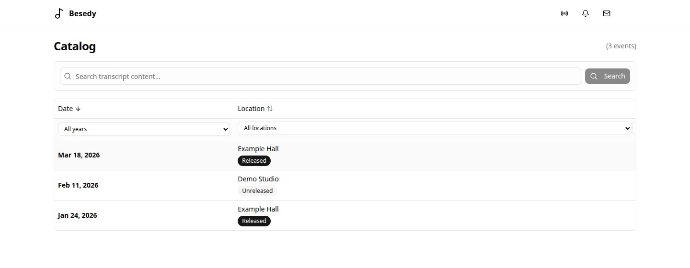
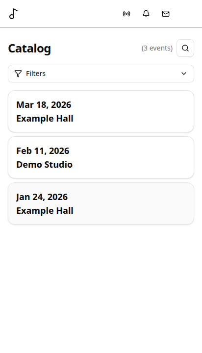
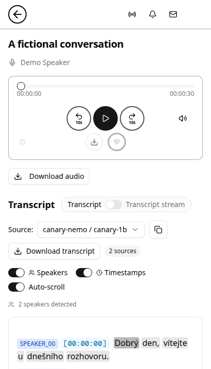

# Besedy

**Turn recordings into an archive you can listen to, read, and search.**

Besedy takes care of the work between raw audio and something people can
actually use. It catalogs recordings, prepares the audio, creates multilingual
transcripts, identifies speakers, and indexes spoken content for search. The
companion web app lets people listen, read along, and find moments across the
archive.

Besedy is self-hosted and was built with Czech spoken-word collections in mind.
Languages and transcription backends are configurable, so the same workflow can
support multilingual archives.

[Maintainer deployment (sign-in required)](https://besedy.org) ·
[Get started](#get-started) ·
[Read the documentation](docs/README.md)



*Desktop and mobile views shown with entirely synthetic demonstration data.*

<table>
  <tr>
    <th>Browse events</th>
    <th>Listen and read along</th>
  </tr>
  <tr>
    <td></td>
    <td></td>
  </tr>
</table>

## What you can do with Besedy

- Bring a folder of recordings into a content-addressed catalog that detects
  duplicates and keeps track of processing state.
- Prepare and normalize audio before sending it to one or more transcription
  backends.
- Transcribe Czech and other languages with faster-whisper, WhisperX, NeMo
  Canary, or Qwen3-ASR.
- Separate speakers with pyannote and build a search index across transcripts.
- Browse recordings, stream audio, read transcripts, and search spoken content
  from the web app.

You can use the processing toolkit on its own or run it together with the web
app.

## How it fits together

This repository contains two parts:

- **Processing toolkit** (`besedy/`) — a Python CLI for cataloging, preparing,
  transcribing, diarizing, and indexing recordings.
- **Web app** (`web/`) — a Next.js interface for browsing the resulting archive,
  listening to recordings, and searching transcripts. See
  [web/README.md](web/README.md) for setup.

```text
recordings → catalog and prepare → transcribe and identify speakers
           → index transcripts → browse, listen, and search
```

## Get started

### Prerequisites

- Python >=3.12 (3.13 recommended)
- [uv](https://github.com/astral-sh/uv) package manager
- [just](https://github.com/casey/just) command runner
- ffmpeg/ffprobe (required for audio processing)

The above covers the core CLI. Transcription and diarization have extra
requirements (GPU, Docker, a Hugging Face token) — see
[Backends](#backends).

### Setup

```bash
just setup
```

`just setup` installs the lean core CLI plus dev tooling. Transcription and
diarization backends run through Docker, so their heavy
runtime dependencies are no longer part of the default host environment. Use
`just setup-ml` for host-side ML, retrieval, and speaker helpers;
`just setup-jobs` for Prefect jobs tooling; or `just setup-all` when you
explicitly want every optional extra in one environment. `just test` pulls in
the optional extras it needs when running the full suite. Jobs and all-extras
setup refresh `rlmbenchy` from its latest default-branch revision before
syncing.

### Configuration

Every `catalog` command reads `besedy.toml`, which is not part of the checkout.
Create it before the first run:

```bash
mkdir -p ~/.config/lukleh/besedy
cp besedy.toml.example ~/.config/lukleh/besedy/besedy.toml
```

Then set `[paths].text_data_dir` (required — it is where catalogs and transcripts
are written); the other paths have working defaults. To keep the config
elsewhere, point `BESEDY_CONFIG` at it instead:

```bash
export BESEDY_CONFIG=/path/to/besedy.toml
```

See [`besedy.toml.example`](besedy.toml.example) for the full key reference and
the environment overrides.

### Basic workflow

```bash
# One-time bootstrap for a new catalog
just catalog create "/path/to/media"

# Routine ingest: add newly discovered recordings to the existing catalog
just catalog add

# Process pending recordings through the configured pipeline
just catalog run-pipeline
```

With no path argument, `catalog add` re-scans the `Scan Root` values already in
the catalog. Pass one or more paths to ingest a new location explicitly.

### Transcription Language

Language is configured per `[[transcription_workflows]]` entry in
`besedy.toml` as an ISO 639 code (Qwen3-ASR's language names are derived from
the code automatically). Use `language = "auto"` for backends that support
language detection, such as faster-whisper, WhisperX, and Qwen3-ASR. Canary
prompts require a concrete language code, so the example configuration keeps
`language = "cs"` for Canary.

Entries that omit `language` keep the historical forced-Czech behavior
(`"cs"`) and their legacy output paths, so existing configs and transcripts
keep working; automatic detection is always an explicit opt-in. When WhisperX
uses automatic detection, omit `align_model` so WhisperX can select an
alignment model for the detected language. See
[`besedy.toml.example`](besedy.toml.example) for complete examples.

## Commands Overview

| Command | Description |
|---------|-------------|
| `catalog add [dir]` | Add new files to existing catalog (auto-detects from Scan Root if dir omitted) |
| `catalog run-pipeline` | Process pending catalog entries through audio preparation, transcription, indexing, and derived outputs |
| `catalog create <dir>` | Bootstrap a catalog by scanning a directory and computing hashes and metadata |
| `catalog merge <a> <b>` | Merge two catalog CSVs |
| `catalog clean` | Remove entries for missing source files and derivatives |
| `catalog check` | Verify pipeline integrity |
| `catalog loudness` | Run the loudness-analysis pipeline step directly for diagnosis or recovery |
| `catalog stage-audio` | Run the 16 kHz mono staging step directly for diagnosis or recovery |
| `catalog transcribe` | Run configured transcription workflows directly |
| `transcribe-oneoff <audio>` | Transcribe file(s) with faster-whisper and write `<stem>.transcript.*` beside the audio, without catalog registration |
| `catalog diarize` | Run speaker diarization directly |
| `catalog cluster-speakers` | Match diarized speakers across recordings |
| `catalog rag-colbert-index` | Build the ColBERT sidecar index; defaults to the GPU Docker indexer on GPU hosts while keeping CPU query serving unchanged |

Run `just catalog <command> --help` for detailed options.
Run `just transcribe-oneoff --help` for the standalone one-off transcription script.

## Pipeline Execution

`catalog run-pipeline` is the normal operator entry point. It composes the
lower-level loudness, staging, archive, transcription, diarization, indexing,
and export handlers. Those individual commands remain available for diagnosis,
recovery, and targeted reruns without restarting the whole pipeline.

## Verification & Analysis

```bash
# Quick health check
uv run python besedy/cli/catalog.py validate --input-path transcripts/ --batch --limit 50
uv run python besedy/cli/analyze.py validate

# Compare models for one recording
uv run python besedy/cli/analyze.py compare --hash <audio_hash>

# Repetition severity
uv run python besedy/cli/analyze.py repetition

# Candidate replacements for repetitive spans
uv run python besedy/cli/analyze.py patch-candidates --hash <audio_hash>
```

Run `uv run python besedy/cli/analyze.py --help` for all analysis commands.

## Backends

### Requirements

The **core CLI** (cataloging, audio staging, loudness normalization, analysis) runs
on CPU with only Python + ffmpeg — no GPU or model downloads. The ML backends
are heavier:

- **GPU / Docker.** Transcription and diarization run as Docker images and
  require an **NVIDIA GPU with CUDA** plus the **NVIDIA Container Toolkit** (no
  CPU path). See [docs/backends.md](docs/backends.md).
- **Hugging Face token (gated models).** Speaker diarization and clustering use gated pyannote
  models: create a free Hugging Face account, accept the conditions on each
  model's page, and export `HF_TOKEN` before the first run. Transcription models
  are not gated.
- **Model downloads.** Models download from Hugging Face on first use and cache
  under `HF_HOME` (default `~/.cache/huggingface`); individual models can be
  several GB. See [Third-party models & licenses](#third-party-models--licenses)
  for the full list, licenses, and which are gated.

### Transcription
- **NeMo Canary** (`canary-nemo`): NVIDIA's multi-language model with VAD
- **faster-whisper** (`faster-whisper`): CTranslate2-based Whisper with GPU acceleration
- **WhisperX** (`whisperx`): Whisper + alignment pipeline (word timestamps, VAD support)
- **Qwen3-ASR** (`qwen3-asr`): Qwen3-ASR with external Silero VAD segmentation

### Diarization
- **pyannote** (`pyannote`): Neural speaker diarization (recommended)

> Model licenses & access (some are gated or non-commercial): see
> [Third-party models & licenses](#third-party-models--licenses).

## Optional Beam + WhisperX Alignment (PoC)

This non-default workflow uses NeMo beam decoding for text quality, then
WhisperX to align word timestamps. Its example config entry has
`pipeline_default = false`; invoke it explicitly when evaluating the PoC.

```bash
just catalog transcribe \
  --workflow canary-nemo \
  --overwrite \
  --nemo-decode-strategy beam
```

Defaults: `beam_size=2`, `softmax_temperature=1.0` (override via
`--nemo-beam-size` / `--nemo-softmax-temperature` if needed).
Beam mode writes `nemo_beam_segments.json` and then aligns with WhisperX to
produce canonical output through the Docker whisperx worker.

Outputs (next to the transcript):
```
nemo_beam_segments.json
nemo_beam_aligned.json
transcript.json
```

If your transcripts symlink isn’t `./transcripts`, pass:
`--transcripts-root /path/to/transcripts` (and optionally `--workflow`).

## Output Structure

```
transcripts/
├── canary-nemo/<output-component>/<audio_hash>/transcript.json
├── faster-whisper/<output-component>/<audio_hash>/transcript.json
├── whisperx/<output-component>/<audio_hash>/transcript.json
├── qwen3-asr/<output-component>/<audio_hash>/transcript.json
└── speaker_diarization/<output-component>/<audio_hash>/speakers.json
```

The output component includes the configured model, VAD, optional alignment
model, and decoding strategy. Automatic and explicitly non-Czech language
variants append `@lang-auto` or `@lang-<code>` so they cannot reuse transcripts
from a different language setting. Explicit Czech (`cs`) keeps the historical
path without a language suffix.

If an existing web deployment sets `RAG_BACKEND_KEY`, update it to the new
language-aware backend key (for the default workflow,
`faster-whisper/large-v3@silero_vad_v6@lang-auto`). Repository defaults and
environment templates already use that key; private env files are not rewritten.

## Optional: Backend Image Builds

```bash
docker compose -f backends/docker-compose.yml build \
  faster-whisper whisperx qwen3-asr nemo pyannote
```

Builds the Docker images used by the migrated ML backends. The Besedy CLI now
launches those workers through Docker by default.

Optional host extras:

- `just setup-ml` for host-executed workflow helpers, RAG tooling, and speaker utilities
- `just setup-jobs` for Prefect jobs modules
- `just setup-all` for a full host environment

## Development

```bash
uv run python besedy/cli/catalog.py --help  # All catalog options
uv run python besedy/cli/catalog.py validate --help   # Transcript validation options
uv run python besedy/cli/analyze.py --help  # Analysis options
just ruff
just ruff-format
just ty
```

`ruff` runs against a focused core subset — `besedy/core`,
`besedy/lib/backend_ids.py`, `besedy/lib/audio/types.py`,
`besedy/lib/workflow/common.py`, and `besedy/lib/workflow/paths.py`. Use
`just ruff` for lint checks and `just ruff-format` to reformat that surface.
`ty` (`just ty` or `uv run ty check`) type-checks the whole `besedy` package.

## Documentation

See `docs/README.md` for a guide to the documentation set and the key references.

## License

Besedy is released under the [MIT License](LICENSE).

Note: the MIT license covers Besedy's own code — **not** the third-party models
or runtime dependencies it downloads. See
[Third-party models & licenses](#third-party-models--licenses) for the per-model
terms (some are gated or non-commercial) and [NOTICE.md](NOTICE.md) for the
repository's third-party-source attribution status.

## Third-party models & licenses

Besedy downloads speech, alignment, and RAG **models** that carry their own
licenses and access terms. Review these before use — especially for
**commercial** deployments:

| Model | Used for | License | Commercial | Gated (HF) |
|-------|----------|---------|:----------:|:----------:|
| `Systran/faster-whisper-large-v3` | faster-whisper transcription (default) | MIT | ✅ | no |
| `nvidia/canary-1b-v2` | Transcription (NeMo Canary) | CC-BY-4.0 | ✅ | no |
| `Qwen/Qwen3-ASR-1.7B` | Qwen3-ASR transcription | Apache-2.0 | ✅ | no |
| `mikr/whisper-large-v3-czech-cv13` | faster-whisper Czech variant (optional) | Apache-2.0 | ✅ | no |
| `comodoro/wav2vec2-xls-r-300m-cs-250` | WhisperX alignment (Czech) | Apache-2.0 | ✅ | no |
| `Qwen/Qwen3-ForcedAligner-0.6B` | Qwen3-ASR alignment | Apache-2.0 | ✅ | no |
| `pyannote/speaker-diarization-community-1` | Speaker diarization | CC-BY-4.0 | ✅ | **yes** |
| `pyannote/embedding` | Speaker embeddings | MIT | ✅ | **yes** |
| `jinaai/jina-colbert-v2` | **RAG ColBERT retrieval (default)** | **CC-BY-NC-4.0** | **❌ non-commercial** | no |
| `BAAI/bge-m3` | RAG dense embedder (default) | MIT | ✅ | no |
| `Alibaba-NLP/gte-multilingual-reranker-base` | RAG reranker + chunk tokenizer | Apache-2.0 | ✅ | no |
| `Qwen/Qwen3-Embedding-0.6B` | RAG dense embedder (alternate) | Apache-2.0 | ✅ | no |
| `BAAI/bge-reranker-v2-m3` | RAG reranker (alternate) | Apache-2.0 | ✅ | no |

**⚠️ Only the default RAG retriever is non-commercial.** `jinaai/jina-colbert-v2`
is CC-BY-NC-4.0 (no commercial use); every other model above is
Apache-2.0 / MIT / CC-BY-4.0 (commercial-OK). For a commercial deployment, switch
the ColBERT model — set the `RAG_COLBERT_MODEL` environment variable or pass
`--rag-colbert-model <model>` (e.g. an Apache/MIT-licensed ColBERT such as
`colbert-ir/colbertv2.0`; verify its terms on the model card).

**Gated models.** `pyannote/speaker-diarization-community-1` and
`pyannote/embedding` require a free Hugging Face account, accepting the
conditions on each model page, and an `HF_TOKEN` before download.

**Attribution.** CC-BY, CC-BY-NC, Apache-2.0, and MIT all require retaining the
upstream copyright/license notices.

Licenses were verified from each model card; always re-check the card for the
authoritative, current terms. Not every model runs in every pipeline — the
transcription backends (faster-whisper / Canary / Qwen3-ASR) are alternatives,
and RAG reranking is opt-in — so a given install pulls only a subset.
