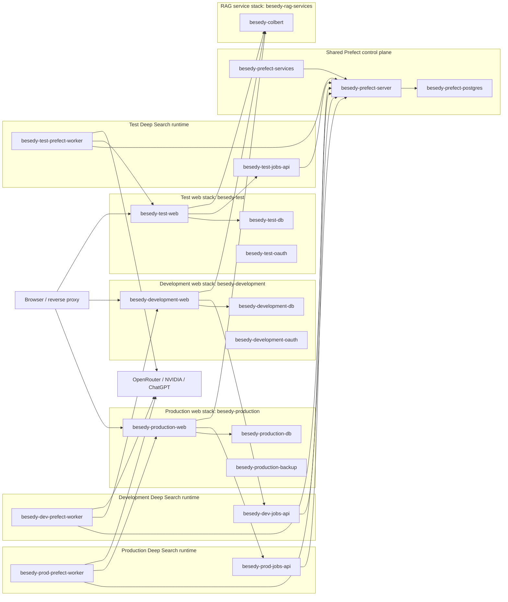

# Docker Container Topology

> **Last Updated:** 2026-04-26
> **Status:** Operational map and cleanup target.

This document maps the Docker containers around the Besedy web app, RAG service,
Deep Search runtimes, and shared Prefect control plane. It distinguishes
environment-specific containers from shared services, and calls out where the
current local host state does not match the intended production topology.

## High-Level Topology



The diagram above is the target shape. Prefect is shared across environments as
the orchestration control plane. The Deep Search runtime is environment-specific:
each environment gets its own jobs API, worker, work pool, deployment name,
internal web URL, secrets, and output path.

Before deploying, compare the target shape with the environment using the
[deployment inventory checklist](#deployment-inventory-checklist).

## Compose Stacks

| Stack | Compose file | Project/name | Purpose | Environment-specific? |
| --- | --- | --- | --- | --- |
| Web | `web/docker-compose.yml` plus overlays | wrapper-controlled `besedy-${BESEDY_COMPOSE_INSTANCE}` | Web app, web DB, optional OAuth mock, optional backup | Yes |
| Prefect control plane | `jobs-service/docker-compose.prefect.yml` | `besedy-prefect` | Prefect API/UI, services, Prefect DB | Shared singleton |
| Deep Search runtime | `jobs-service/docker-compose.jobs-{dev,test,prod}.yml` | `besedy-jobs-{dev,test,prod}` | Jobs API and Prefect worker for one web environment | Yes |
| RAG | `rag-services/docker-compose.yml` | `besedy-rag-services` | ColBERT sidecar and optional legacy TEI services | Shared singleton |
| ML backends | `backends/docker-compose.yml` | varies | Legacy/auxiliary model backends | Not part of current Deep Search path |

## Web Stacks

The web stack's Docker identity is controlled independently from the app runtime
mode. `scripts/run_web_compose.sh` fixes both values per mode, renders the full
configuration, and rejects cross-environment names or volumes before running the
requested Compose command. Inherited `APP_ENV` and `COMPOSE_PROJECT_NAME` values
cannot redirect a test command to production resources.

| Environment | Containers | Docker network | Host ports | Data volume |
| --- | --- | --- | --- | --- |
| Development | `besedy-development-web`, `besedy-development-db`, `besedy-development-oauth` | `besedy-development_default` | web `3001`, DB `5433` | `besedy_development_postgres` |
| Test | `besedy-test-web`, `besedy-test-db`, `besedy-test-oauth` | `besedy-test_default` | web `3002`, DB `5434` | `besedy_test_postgres` |
| Production | `besedy-production-web`, `besedy-production-db`, `besedy-production-backup` | `besedy-production_default` | web `127.0.0.1:3000`, DB `127.0.0.1:5432` | `besedy_production_postgres` |

All web database volumes mount at `/var/lib/postgresql`, the PostgreSQL 18 parent
data directory. The production volume is external; development and test volumes
remain Compose-managed.

The web containers should also join `besedy-internal` when they need to call
or be called by their Deep Search runtime. For the first production Deep Search
rollout, production web must be recreated after the merge so it joins
`besedy-internal`.

### Web Responsibilities

- Browser-facing catalog UI.
- PostgreSQL-backed web data.
- Labs and catalog access checks.
- Deep Search proxy routes under `/api/catalogs/:id/deep-search/*`.
- Internal worker routes under `/api/internal/deep-search/*`.
- Calls ColBERT through `RAG_COLBERT_URL`.
- Calls jobs API through `JOBS_API_BASE_URL`.

### Web Environment Rules

- `DATABASE_URL` is environment-specific.
- `WEB_PORT` is environment-specific.
- `BESEDY_JOB_SERVICE_SECRET` must match the Deep Search runtime that web calls.
- `JOBS_API_BASE_URL` should use a Docker-network URL in production:

```bash
JOBS_API_BASE_URL=http://besedy-prod-jobs-api:8390
```

Do not point production web at the current `besedy-jobs-api` container. That
container is the current development runtime until it is explicitly renamed or
replaced by `besedy-dev-jobs-api`.

## Deep Search Runtime And Prefect

The target topology deliberately splits Deep Search into two layers:

- shared Prefect control plane
- environment-specific Deep Search runtimes

Prefect should be shared across dev, test, and production because it is the
orchestration service. Sharing it gives one UI, one run history, one scheduler,
and one operational place to inspect flow runs. The web apps should not call
Prefect directly; each web app calls its own jobs API, and each jobs API submits
to the shared Prefect API.

The Deep Search runtime should not be shared across environments. The runtime is
where environment-specific behavior lives:

- `BESEDY_INTERNAL_BASE_URL`
- `BESEDY_JOB_SERVICE_SECRET`
- provider API keys available to the worker
- output root and output environment
- work pool name
- deployment name
- worker concurrency

Keeping a jobs API and worker per environment avoids routing production jobs
through a process configured for development, and it prevents one shared worker
from having to infer which Besedy web container, secret, and output path belong
to a run.

### Current Jobs Compose State

The control plane and environment runtimes are split across the Compose files
listed above. The shared control plane owns `besedy-prefect-postgres`,
`besedy-prefect-server`, and `besedy-prefect-services`; each runtime owns its
explicitly named jobs API and worker.

All runtimes share the external `besedy-prefect` network. Web-to-runtime calls
use `besedy-internal`. Each runtime binds only its own output environment under
`${BESEDY_STATE_HOME}/deep-search`; production packages code into its image and
does not mount a repository checkout.

### Shared Prefect Responsibilities

- Own orchestration state, run state, scheduling, and concurrency metadata.
- Expose Prefect API/UI to operators.
- Store flow/deployment metadata for all environments.
- Provide work pools that workers from each environment can poll.

Prefect must not be the place where web environment routing is decided. It can
store environment-specific deployment names and run parameters, but the runtime
container configuration should determine which web environment a worker can call.

### Runtime Responsibilities

- `jobs-api` exposes the Besedy jobs facade.
- `prefect-worker` executes Deep Search flow runs.
- Worker calls Besedy internal routes for search, chunk windows, and metadata.
- Worker runs `rlmbenchy` installed into the image at build time.

### Environment Naming Rules

Use explicit work pools and deployments per environment:

| Environment | Jobs API | Worker | Work pool | Deployment | Output env |
| --- | --- | --- | --- | --- | --- |
| Development | `besedy-dev-jobs-api` | `besedy-dev-prefect-worker` | `besedy-deep-search-dev` | `deep_search_flow/deep-search-dev` | `dev` |
| Test | `besedy-test-jobs-api` | `besedy-test-prefect-worker` | `besedy-deep-search-test` | `deep_search_flow/deep-search-test` | `test` |
| Production | `besedy-prod-jobs-api` | `besedy-prod-prefect-worker` | `besedy-deep-search-prod` | `deep_search_flow/deep-search-prod` | `prod` |

The current names `besedy-jobs-api`, `besedy-prefect-worker`, and
`deep_search_flow/deep-search-default` are transitional development names from
the first single-runtime implementation. They should be renamed or replaced by
the explicit development names above before production is connected.

If multiple runtime jobs APIs are published to the host, each environment needs
a distinct host port. The container port can remain `8390` inside each runtime
network, but Docker cannot bind dev and prod to the same host port.

### Production Runtime Environment Rules

For production Deep Search:

```bash
BESEDY_INTERNAL_BASE_URL=http://besedy-production-web:3000
DEEP_SEARCH_OUTPUT_ENV=prod
DEEP_SEARCH_OUTPUT_DIR=/state/lukleh/besedy/deep-search/prod
DEEP_SEARCH_EXECUTION_MODE=rlm
BESEDY_JOB_SERVICE_SECRET=<same-value-as-production-web>
RLMBENCHY_LM_PROFILE=model-openrouter-openai-gpt-oss-120b_high
RLMBENCHY_SUB_LM_PROFILE=model-openrouter-openai-gpt-oss-20b_high
PREFECT_DEEP_SEARCH_WORK_POOL=besedy-deep-search-prod
PREFECT_DEEP_SEARCH_DEPLOYMENT_NAME=deep-search-prod
PREFECT_DEEP_SEARCH_FULL_DEPLOYMENT_NAME=deep_search_flow/deep-search-prod
PREFECT_WORKER_LIMIT=10
PREFECT_DEEP_SEARCH_CONCURRENCY_LIMIT=10
```

Provider keys are worker runtime secrets:

```bash
OPENROUTER_API_KEY=<secret>
NVIDIA_API_KEY=<secret>
```

Do not pass provider keys through web job payloads.

Production jobs code is packaged into `BESEDY_JOBS_IMAGE`; the production
Compose file has no repository source mount. Both jobs containers run non-root
with read-only root filesystems, dropped capabilities, and an ephemeral `/tmp`.
The API reads the output bind mount, while only the worker can write it. For
ChatGPT profiles, an opt-in overlay mounts only the host Codex `auth.json`, not
`~/.codex`; other provider profiles run without any Codex credential mount.

### Should Prefect Be Shared Across Environments?

Yes. The shared component should be the Prefect control plane:

- `besedy-prefect-server`
- `besedy-prefect-services`
- `besedy-prefect-postgres`

Every environment needs access to that control plane so it can submit and run
Deep Search jobs. The separation should happen at the jobs API, worker, work
pool, deployment, and output path level.

### Should The Jobs Runtime Be Shared Across Environments?

No. A shared runtime is the risky part, because it owns the environment-specific
web URL, internal secret, provider runtime secrets, output path, and worker
limits.

Recommended rule:

- One shared Prefect control plane.
- One jobs API and one worker per web environment that needs Deep Search.
- One work pool and one deployment per environment.
- No production web calls to a development jobs API.
- No development worker calls to production web.

The repo uses separate compose files for the shared Prefect control plane and
each runtime. Do not collapse this into one profile-heavy compose file; separate
files make prod operations easier to review and reduce the chance of starting
the wrong runtime with the wrong env file.

Target file layout:

```text
jobs-service/docker-compose.prefect.yml
jobs-service/docker-compose.jobs-dev.yml
jobs-service/docker-compose.jobs-test.yml
jobs-service/docker-compose.jobs-prod.yml
```

Target config env files:

```text
~/.config/lukleh/besedy/jobs.env.prefect
~/.config/lukleh/besedy/jobs.env.dev
~/.config/lukleh/besedy/jobs.env.test
~/.config/lukleh/besedy/jobs.env.prod
```

## RAG / ColBERT Stack

The ColBERT service currently runs as:

- container: `besedy-colbert`
- compose project: `besedy-rag-services`
- host endpoint: `http://127.0.0.1:8192`
- common web setting: `RAG_COLBERT_URL=http://host.docker.internal:8192/query`
- state bind: `${BESEDY_STATE_HOME}/tmp/rag_colbert:/data/state/rag_colbert`
- model cache volumes:
  - `besedy_colbert_model_cache`
  - `besedy_colbert_torch_cache`

### Should ColBERT Be Shared Across Environments?

Yes, with constraints.

It is acceptable to share ColBERT across dev/test/prod when:

- the service is read-mostly at query time
- all environments intentionally query the same catalog/index roots
- index rebuilds are coordinated
- experiments do not replace the active index under production traffic

Use a separate ColBERT stack or separate host port when testing:

- new index formats
- new chunking
- new model images
- destructive index rebuild flows
- high-load experiments that could degrade production search

## Shared Network

`besedy-internal` is the cross-stack Docker network for web and Deep Search
runtimes.

The shared Prefect API must also be reachable from every jobs API and worker.
That can be done with a separate shared Prefect Docker network or by attaching
runtime containers to the Prefect compose network. The web containers do not
need direct access to Prefect.

Required members for production Deep Search:

- `besedy-production-web`
- production jobs API
- production Prefect worker

## Deployment Inventory Checklist

Use `docker ps` and `docker network inspect` on the target host and verify:

1. Each environment has its own web app, jobs API, Prefect worker, secrets, and
   output path.
2. The web app, jobs API, and worker for an environment share the intended
   internal network; development and test containers are not connected to the
   production runtime network.
3. Only the production web and database ports intended for host access are
   bound, and database ports use loopback unless remote access is explicitly
   required.
4. Prefect server, services, and database are the only shared orchestration
   containers, and every worker can reach the Prefect API.
5. Required database migrations have completed before application rollout.
6. The active ColBERT service and index match the expected model and chunk
   format.

## Target Production Runtime

After the Deep Search production deployment:

| Container | Network memberships | Should be shared? |
| --- | --- | --- |
| `besedy-production-web` | `besedy-production_default`, `besedy-internal` | No, production-specific |
| `besedy-production-db` | `besedy-production_default` | No, production-specific |
| `besedy-production-backup` | `besedy-production_default` | No, production-specific |
| production jobs API | production runtime network, `besedy-internal`, shared Prefect network | No, production-specific |
| production Prefect worker | production runtime network, `besedy-internal`, shared Prefect network | No, production-specific |
| `besedy-prefect-server` | shared Prefect network | Yes |
| `besedy-prefect-services` | shared Prefect network | Yes |
| `besedy-prefect-postgres` | shared Prefect network | Yes |
| `besedy-colbert` | RAG stack network and host port `8192` | Shared, with constraints |

## Connectivity Checks

Production web to production jobs API:

```bash
docker exec besedy-production-web wget -qO- http://besedy-prod-jobs-api:8390/health
```

Worker to production web:

```bash
docker exec besedy-prod-prefect-worker python - <<'PY'
from urllib.request import urlopen
print(urlopen("http://besedy-production-web:3000/api/health", timeout=5).read().decode())
PY
```

Network membership:

```bash
docker network inspect besedy-internal \
  | jq -r '.[].Containers | to_entries[] | .value.Name'
```

Expected production members:

```text
besedy-production-web
besedy-prod-jobs-api
besedy-prod-prefect-worker
```

ColBERT health:

```bash
curl -fsS http://127.0.0.1:8192/health
```

Production jobs API health:

```bash
curl -fsS "http://127.0.0.1:${PROD_JOBS_PORT}/health"
```

Production web health:

```bash
curl -fsS http://127.0.0.1:3000/api/health
```

## Cleanup Recommendations

Before production Deep Search rollout:

1. Preserve the current `besedy-jobs-api` and `besedy-prefect-worker` as the
   development runtime until they are renamed to `besedy-dev-*`.
2. The legacy combined stack has been retired — `docker-compose.legacy.yml` and
   the `just jobs-legacy-*` recipes were removed. If an old combined stack is
   somehow still running on a host, back up Prefect and stop it manually before
   proceeding.
3. Start shared Prefect and the explicit development runtime with
   `just prefect-up`, `just jobs-dev-up`, and `just jobs-dev-deploy`.
4. Add a new production runtime with production container names, production env
   from `~/.config/lukleh/besedy/jobs.env.prod`, production work pool, and
   production deployment.
5. Add production `JOBS_API_BASE_URL` and `BESEDY_JOB_SERVICE_SECRET` to the
   production web env file.
6. Run `just prod-deploy` so production web is rebuilt, migrated, restarted, and
   attached to `besedy-internal`.
7. Deploy/register the production work pool and deployment against shared
   Prefect.
8. Verify `besedy-internal` contains production web, the production jobs API,
   and the production worker.
9. Verify worker output goes to:

```text
/home/<user>/.local/state/lukleh/besedy/deep-search/prod/<flow-run-id>/
```

Medium-term cleanup:

- Remove the legacy combined compose file after the host has fully migrated to
  the split stack.
- Consider moving ColBERT from host-port access to an explicit shared Docker network if we want less reliance on `host.docker.internal`.
- Remove or archive stale Docker volumes after confirming they are not used:
  - `besedy-dev_besedy_dev_postgres`
  - `besedy-prod_besedy_prod_postgres`
  - `besedy-test_besedy_test_postgres`
